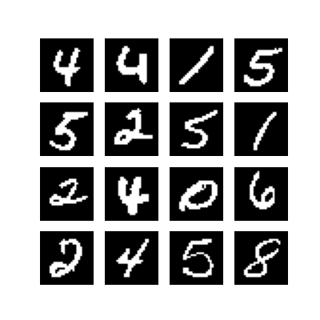
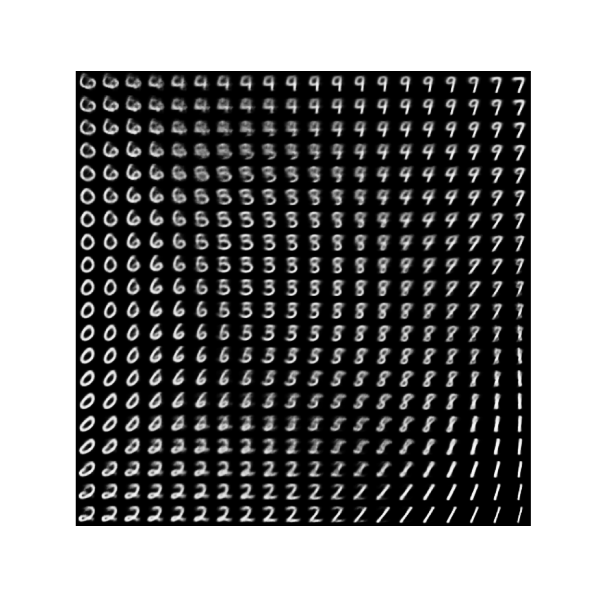

# VAE

A basic implementation of *Variational Auto-Encoders* based on the [tensorflow tutorial](https://www.tensorflow.org/tutorials/generative/cvae) with some small changes. This directory contains the following files:

* `model.py`: defines the model architecture;
* `train_mnist.py`: trains the model on the MNIST Handwriten Digits Dataset;
* `make_gif.py`: transforms saved generated images for a training run into a GIF file such as the one above;
* `make_2d_plots.py`: plots part of the latent space by decoding points into images. The result is an image as the one below;

Additionally, the `generated_samples/` and `plots/` directories contain examples from a training run.

## Experiment

As a proof of concept, this model was trained for 100 epochs on the MNIST dataset. The results are shown below:

### Animation of generated images

The image below depicts the original test set images:

Below is the animation for the training run. Each frame corresponds to a batch of generated images after an epoch.

## Latent space visualization

Below is a visualization of the latent space for the trained model.

