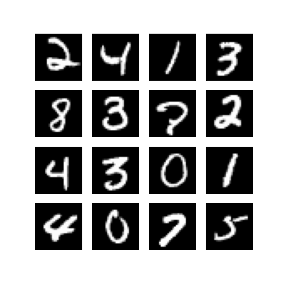
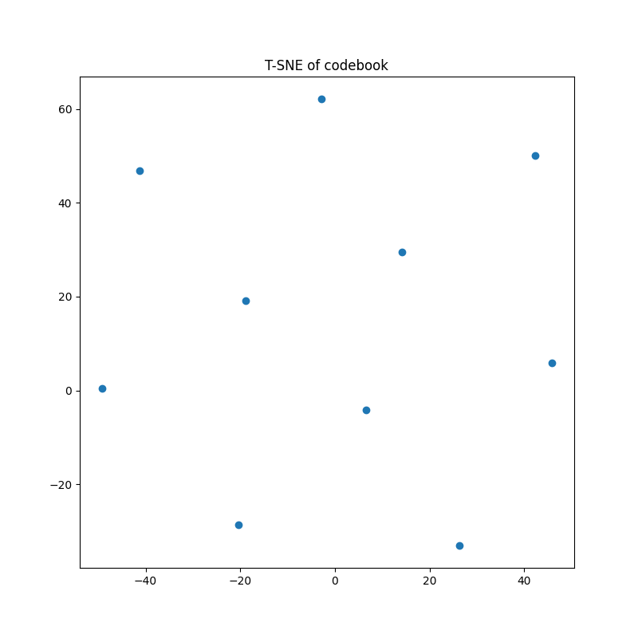
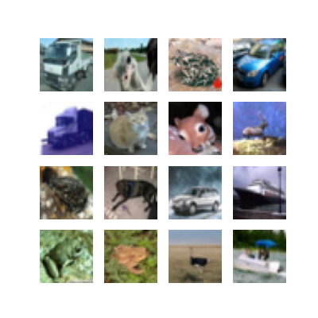
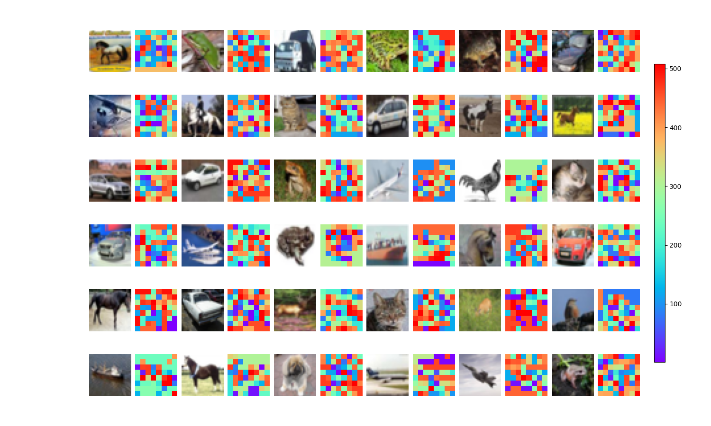

# VQ-VAE

This directory contains an implementation of *Vector Quantized Variational Auto-Encoders*, introduced in [van den Oord et al. (2017)](https://arxiv.org/abs/1711.00937).
I used the [Sonnet implementation](https://github.com/deepmind/sonnet/blob/master/sonnet/python/modules/nets/vqvae.py) as well as a [notebook by Amélie Royer](https://ameroyer.github.io/projects/2019/08/20/VQVAE.html) as references.
This directory contains the following scripts:

* `train.py`: trains a VQ-VAE on either the MNIST or CIFAR-10 datasets;

* `visualize_codes.py`: samples a batch of images and displays them alongside their quantized codes.

Usage information is available by using the `--help` flag. 
Additionally, the following directories `plots/` and `logs/` contain plots and tensorboad logs for training runs, respectively.

## Experiments

I tested this implementation by training the model on the MNIST and CIFAR-10 dataset. The results are shown below.
For each experiment, the corresponding plots and logs are available on the `plots/` and `logs/` directories, respectively.

### MNIST

I trained the VQ-VAE model on the MNIST dataset for 20 epochs. The run name is `vqvae-mnist` for the plots and tensorboard logs.
The image below depicts a batch of sampled images from the test dataset.

The following animation displays the reconstructed images of the original sampled batch at the end of each epoch.

Next, we visualize the T-SNE embeddings of the learned codebook.

Finally, we sample images from the test set and visualize the discrete representations learned by the model.

### CIFAR-10

Next, I trained the VQ-VAE model on the CIFAR-10 dataset for 50 epochs. The run name is `vqvae-cifar10` for the plots and tensorboard logs.
The image below depicts a batch of sampled images from the test dataset.

The following animation displays the reconstructed images of the original sampled batch at the end of each epoch.

Next, we visualize the T-SNE embeddings of the learned codebook.

Finally, we sample images from the test set and visualize the discrete representations learned by the model.

